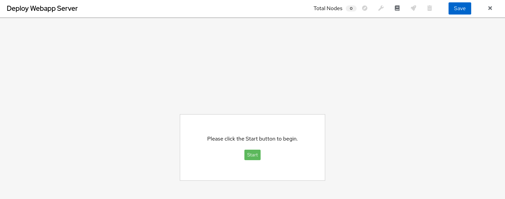
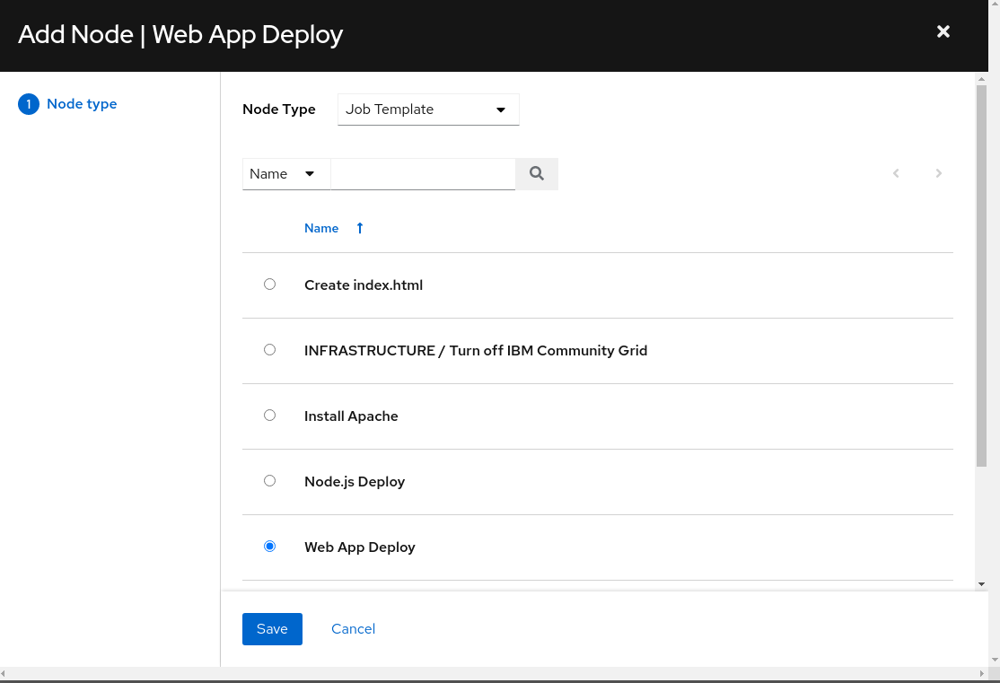
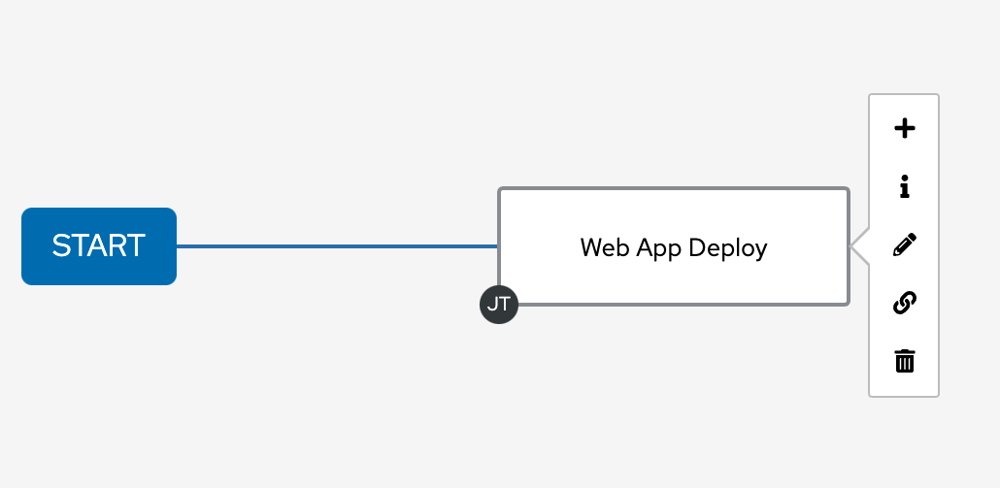
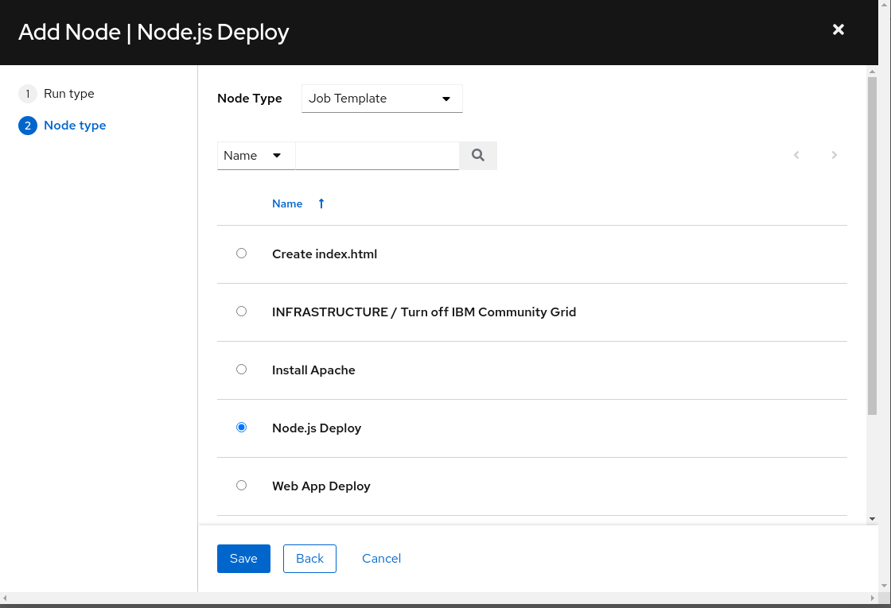
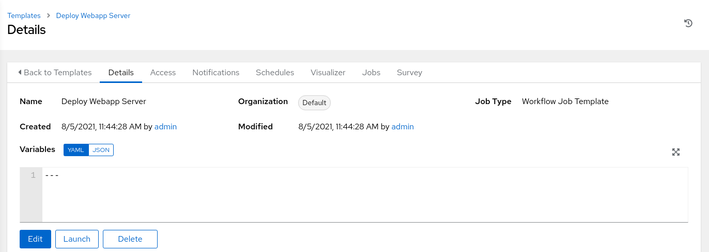

# ワークショップ演習 - ワークフロー

**他の言語でもお読みいただけます**:
<br> [English](README.md)、[日本語](README.ja.md)、 [Portugues do Brasil](README.pt-br.md)、 [Française](README.fr.md)、 [Español](README.es.md)

## 目次

* [目的](#objective)
* [ガイド](#guide)
  * [ラボシナリオ](#lab-scenario)
  * [プロジェクトのセットアップ](#set-up-projects)
  * [ジョブテンプレートのセットアップ](#set-up-job-templates)
  * [ワークフローのセットアップ](#set-up-the-workflow)
  * [ワークロードの起動](#launch-workflow)

## 目的

ワークフローの基本的な考え方は、複数のジョブテンプレートをリンクするというものです。インベントリー、Playbook、さらにはパーミッションを共有する場合と共有しない場合があります。リンクは条件付きにすることができます。

* ジョブテンプレート A が成功すると、その後ジョブテンプレート B が自動的に実行されます。
* ただし、失敗した場合は、ジョブテンプレート C が実行されます。

また、ワークフローは Job Templates に限定されるものではなく、プロジェクトやインベントリーの更新を含めることもできます。

これにより、Ansible
自動コントローラーの新しいアプリケーションが可能になります。さまざまなジョブテンプレートを相互に構築できます。たとえば、ネットワーキングチームは、独自のコンテンツを使用して、独自のGitリポジトリに、さらには独自のインベントリを対象に
Playbook を作成します。一方、運用チームには、独自のリポジトリー、Playbook、およびインベントリーがあります。

このラボでは、ワークフローを設定する方法を説明します。

## ガイド

### ラボシナリオ

組織に 2 つの部門があるとします。

* `webops` という独自の Git ブランチで Playbook を開発している Web 運用チーム
* `webdev` という独自の Git ブランチでプレイブックを開発しているWeb開発者チーム。

デプロイする新しい Node.js サーバーがある場合は、次の 2 つのことが必要です。

#### Web 運用チーム

* `httpd`、`firewalld`、および `node.js` インストールし、`SELinux`
  設定を定義し、ファイアウォールを開き、`httpd` および `node.js` を起動する必要があります。

#### Web 開発者チーム

* Web アプリケーションの最新バージョンをデプロイし、`node.js` を再起動する必要があります。

言い換えると、Web 運用チームは、アプリケーションのデプロイメント用にサーバーを準備し、Web
開発者チームがそのサーバー上にアプリケーションをデプロイします。

---

作業を少し簡単にするために、必要なものはすべて Github リポジトリーに既に存在します。Playbook、JSP
ファイルなどです。接着するだけです。

> **注意**
>
> この例では、別々のチームのコンテンツに同じレポジトリーの異なる 2 つのブランチを使用します。実際には、Source Contorol レポジトリーの構造は、ファクターによってことなります。

### プロジェクトのセットアップ

まず、通常どおりに Git リポジトリーをプロジェクトとして設定する必要があります。

> **警告**
>
> ユーザー **wweb** としてログインしている場合は、*admin** としてログインします。

**Resources** -> **Projects** 内で、**Add** ボタンをクリックして、Web オペレーションチームのプロジェクトを作成します。以下のようにフォームに移動します。

<table>
  <tr>
    <th>パラメーター</th>
    <th>値</th>
  </tr>
  <tr>
    <td>Name</td>
    <td>Webops Git Repo</td>
  </tr>
  <tr>
    <td>Organization</td>
    <td>Default</td>
  </tr>
  <tr>
    <td>Default Execution Environment</td>
    <td>Default execution environment</td>
  </tr>
  <tr>
    <td>Source Control Credential Type</td>
    <td>Git</td>
  </tr>
  <tr>
    <td>Source Control URL</td>
    <td><code>https://github.com/ansible/workshop-examples.git</code></td>
  </tr>
  <tr>
    <td>Source Control Branch/Tag/Commit</td>
    <td><code>webops</code></td>
  </tr>
  <tr>
    <td>Options</td>
    <td><ul><li>✓ Clean</li><li>✓ Delete</li><li>✓ Update Revision on Launch</li></ul></td>
  </tr>
</table>

**Save** をクリックします。

---
**Resources** -> **Projects** 内で、**Add** ボタンをクリックして、Web 開発者チームのプロジェクトを作成します。以下のようにフォームに移動します。

<table>
  <tr>
    <th>パラメーター</th>
    <th>値</th>
  </tr>
  <tr>
    <td>Name</td>
    <td>Webdev Git Repo</td>
  </tr>
  <tr>
    <td>Organization</td>
    <td>Default</td>
  </tr>
  <tr>
    <td>Default Execution Environment</td>
    <td>Default execution environment</td>
  </tr>
  <tr>
    <td>Source Control Credential Type</td>
    <td>Git</td>
  </tr>
  <tr>
    <td>Source Control URL</td>
    <td><code>https://github.com/ansible/workshop-examples.git</code></td>
  </tr>
  <tr>
    <td>Source Control Branch/Tag/Commit</td>
    <td><code>webdev</code></td>
  </tr>
  <tr>
    <td>Options</td>
    <td><ul><li>✓ Clean</li><li>✓ Delete</li><li>✓ Update Revision on Launch</li></ul></td>
  </tr>
</table>

**Save** をクリックします。

### ジョブテンプレートのセットアップ

次に、「通常」ジョブの場合と同じように、2 つのジョブテンプレートを作成する必要があります。

**Resources** -> **Templates** に移動し、**Add** ボタンをクリックして、**Add job template** を選択します。

  <table>
    <tr>
      <th>パラメーター</th>
      <th>値</th>
    </tr>
    <tr>
      <td>Name</td>
      <td>Web App Deploy</td>
    </tr>
    <tr>
      <td>Job Type</td>
      <td>Run</td>
    </tr>
    <tr>
      <td>Inventory</td>
      <td>Workshop Inventory</td>
    </tr>
    <tr>
      <td>Project</td>
      <td>Webops Git Repo</td>
    </tr>
    <tr>
      <td>Execution Environment</td>
      <td>Default execution environment</td>
    </tr>
    <tr>
      <td>Playbook</td>
      <td><code>rhel/webops/web_infrastructure.yml</code></td>
    </tr>
    <tr>
      <td>Credentials</td>
      <td>Workshop Credential</td>
    </tr>
    <tr>
      <td>Limit</td>
      <td>web</td>
    </tr>
    <tr>
      <td>Options</td>
      <td>✓ Privilege Escalation</td>
    </tr>
  </table>

**Save** をクリックします。

---

**Resources** -> **Templates** に移動し、**Add** ボタンをクリックして、**Add job template** を選択します。

  <table>
    <tr>
      <th>パラメーター</th>
      <th>値</th>
    </tr>
    <tr>
      <td>Name</td>
      <td>Node.js Deploy</td>
    </tr>
    <tr>
      <td>Job Type</td>
      <td>Run</td>
    </tr>
    <tr>
      <td>Inventory</td>
      <td>Workshop Inventory</td>
    </tr>
    <tr>
      <td>Project</td>
      <td>Webdev Git Repo</td>
    </tr>
    <tr>
      <td>Execution Environment</td>
      <td>Default execution environment</td>
    </tr>
    <tr>
      <td>Playbook</td>
      <td><code>rhel/webdev/install_node_app.yml</code></td>
    </tr>
    <tr>
      <td>Credentials</td>
      <td>Workshop Credential</td>
    </tr>
    <tr>
      <td>Limit</td>
      <td>web</td>
    </tr>
    <tr>
      <td>Options</td>
      <td>✓ Privilege Escalation</td>
    </tr>
  </table>

**Save** をクリックします。

> **ヒント**
>
> Ansible Playbook がどのようなものかを見たい場合は、Github URL を確認して適切なブランチに切り替えてください。

### ワークフローのセットアップ

ワークフローは **Template** ビューで設定されます。テンプレートを追加するときに、**Add job template** と **Add
workflow template** のどちらかを選択できることに気付いたかもしれません。

**Resources** -> **Templates** に移動し、**Add** ボタンをクリックして、**Add job template** を選択します。

  <table>
    <tr>
      <td><b>Name</b></td>
      <td>Deploy Webapp Server</td>
    </tr>
    <tr>
      <td><b>Organization</b></td>
      <td>Default</td>
    </tr>
  </table>

**Save** をクリックします。

テンプレートを保存すると、**Workflow Visualizer**
が開き、ワークフローを作成できます。テンプレートの詳細ページのボタンを使用して、メニューから **Visualizer** を選択して、後で
**Workflow Visualizer** を再度開くことができます。

  

**Start** ボタンをクリックすると、**Add Node** ウィンドウが開きます。**Job Template** を選択して、ノードタイプで、ノードにアクションを割り当てます。

**Web App Deploy** ジョブテンプレートを選択し、**Save** をクリックします。

  

新しいノードが表示され、ジョブテンプレートの名前で **START** ボタンに接続されます。ノードの上にマウスポインターに移動し、ノードの詳細
(+)、ノードの詳細 (i)の表示(i)、ノードの編集(pencil)、利用可能なノード(chain)へのリンク、ノード(trash
bin)を削除します。

  

ノードにマウスをかざし、(+) 記号をクリックして新規ノードを追加します。* **Run Type** には **On
Success**（デフォルト）を選択し、**Next** をクリックします。

> **ヒント**
>
> 実行のタイプにより、より複雑なワークフローが可能になります。Playbook 実行に成功した実行パスや失敗した実行パスなど、各種パスのレイアウトを行うことができます。

**Node Type** については、**Job Template** (デフォルト) を選択し、**Node.js Deploy** ジョブテンプレートを選択します。
**Save** をクリックします。

  

**Visualizier** ビューの右上にある **Save** をクリックします。

> **ヒント**
>
**Visualizer** には、より高度なワークフローを設定するためのオプションがありますので、ドキュメントをご参照ください。

### ワークフローの起動

**Deploy Webapp Server** Details ページから、ワークフローを **Launch** します。

  

Jobs > Deploy Webapp Server Output にワークフローの実行が表示されていることに注意してください。通常のジョブテンプレートのジョブ実行とは異なり、ジョブが完了しても Playbook の出力はありませんが、ジョブが完了するまでの時間が表示されています。実際の Playbook の実行内容を見たい場合は、詳細を確認したいノードにカーソルを合わせてクリックします。ジョブの詳細表示の中で、**Output** メニューを選択すると、Playbook の出力が表示されます。Deploy WebappServer** ワークフローの **Output** ビューに戻りたい場合は、Views -> Jobs -> **XX - Deploy Webapp Server** で Output の概要に戻ることができます。 

注記: `XX` はジョブ実行の数に置き換えます。


ジョブが完了したら、すべてが正常に動作したかどうかを確認します。コントロールホストから、`node1`、`node2`、および `node3`
に対して以下の curl コマンドを実行します。各 curl コマンドの出力は `Hello World` のはずです。

```bash
[student<X>@ansible-1 ansible-files]$ curl http://nodeX/nodejs
Hello World
```

注記: `X` は、チェックするノードの適切な番号に置き換える必要があります。


---
**ナビゲーション**
<br>
[前の演習](../2.5-rbac) - [次の演習](../2.7-wrap)

[Click here to return to the Ansible for Red Hat Enterprise Linux
Workshop](../README.md#section-2---ansible-tower-exercises)
